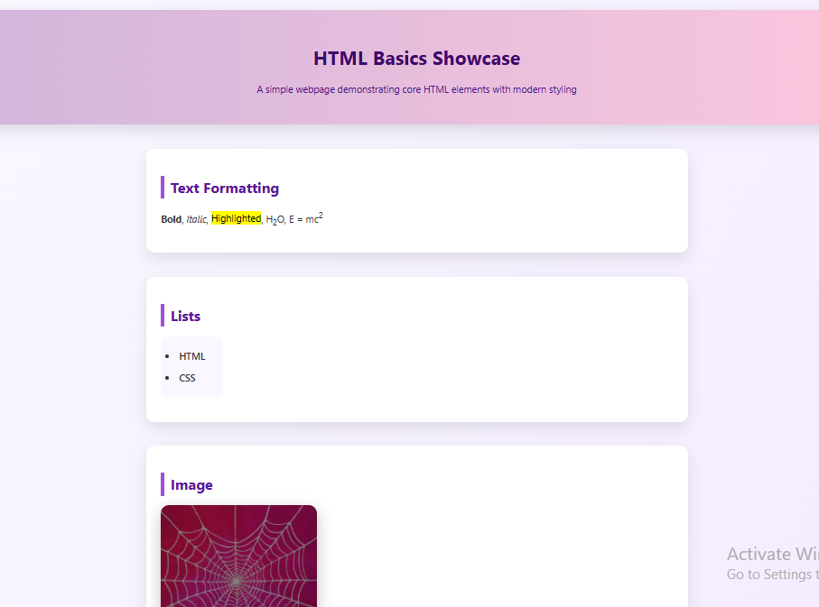
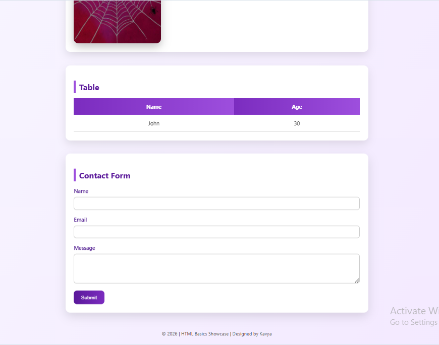

# HTML Basics Showcase

This project is a simple and clean webpage created to demonstrate fundamental HTML elements with modern CSS styling.

It serves as a beginner-friendly showcase of core web development concepts while maintaining a visually appealing layout.

## Features 
- Text formatting elements (bold, italic, subscript, superscript, highlight)
- Ordered and unordered lists
- Image display with hover effect
- Data table with hover styling
- Contact form with styled inputs and focus effects
- Modern UI using gradients, cards, and transitions

## Technologies Used
- HTML5
- CSS3 (Internal CSS)

## Purpose
This project was built as part of my learning journey to strengthen my understanding of HTML structure, semantic elements, and basic CSS styling.

## Preview

## Author
Kavya
